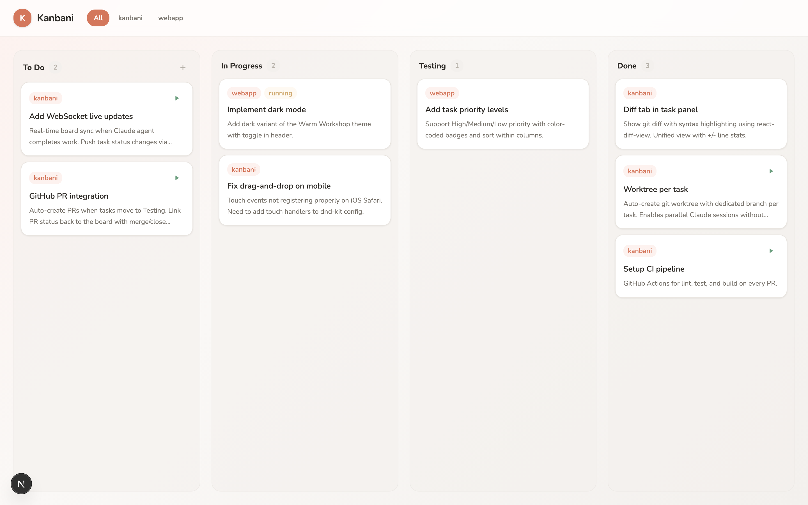

# Kanbani

A kanban board for developers who use [Claude Code](https://docs.anthropic.com/en/docs/claude-code). Create tasks, run AI agents, review diffs, and ship — all from one place.



## Features

- **Kanban board** with drag-and-drop columns (To Do, In Progress, Testing, Done)
- **Run Claude agents** on tasks directly from the board
- **Code diff viewer** — review what the agent changed before merging
- **Git worktree per task** — parallel agent sessions without conflicts
- **Project filtering** — manage tasks across multiple repos
- **Resume sessions** — pick up where Claude left off with one click

## Install

```bash
npm install -g kanbani
```

Then run:

```bash
kanbani
```

Opens `http://localhost:3333` in your browser. Board data is stored in `~/.kanbani/board.json`.

Set a custom port with `PORT=8080 kanbani`.

## How it works

1. **Create a task** — pick a project folder, describe what needs to be done
2. **Run an agent** — Kanbani spawns a Claude Code session in a dedicated git worktree
3. **Review the diff** — see exactly what changed in the Diff tab
4. **Merge or discard** — approve the changes or throw them away
5. **Drag to Done** — move the task across the board as it progresses

Each task gets its own git branch and worktree, so you can run multiple agents in parallel across different tasks without conflicts.

## Development

```bash
git clone https://github.com/dm1tryG/Kanbani.git
cd Kanbani
npm install
npm run dev
```

### Tests

```bash
npm test          # unit tests (vitest)
npm run test:e2e  # e2e tests (playwright)
```

## Tech stack

Next.js, React, TypeScript, Tailwind CSS, dnd-kit, react-diff-view, Playwright

## License

MIT
